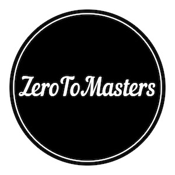

# La caja registradora


Una amiga mía que tiene una frutería me acaba de llamar. Resulta que se ha comprado una caja registradora y el software no esta incluido. Me ha pedido que le haga el favor y se lo desarrolle yo.

## Requerimientos

### Imprescindibles

- Se tiene que poder registrar productos en la transacción
- Cuando se registra un producto, ademas de los datos del producto, se especifica la cantidad a registrar.
- Los productos estan compuestos de: `código de barras`, `nombre` y `precio`.
- El código de barras identifica al producto. Un ejemplo de código de barras es `BA123124X`.
- A veces los clientes cambian de opinion y hay que empezar de cero la transacción.
- Cuando se cobra, tenemos que devolver un resumen de los productos. El formato es:

```
[
	"productos" => [
		[
			"codigo_de_barras" => "BA123124X",
			"nombre" => "Pack 6 manzanas gold",
			"precio" => 5.5,
			"cantidad" => 2,
		],
		[
			"codigo_de_barras" => "BA123333X",
			"nombre" => "Pera",
			"precio" => 0.5,
			"cantidad" => 3,
		]
	],
	"total" => 12.5
}
```
- En el resumen, todos las unidades de un mismo producto son agrupadas.

### Si te sobra tiempo

- Cada linea de producto en el resumen tiene su total
- Cuando el nombre tiene mas de 20 caracteres, hay que truncarlo. No pasa nada si corta palabra a medias.
- Se tiene que poder eliminar productos.
- Cuando se cobra, automáticamente, se tiene que borrar todo para que se pueda atender al siguiente cliente.
